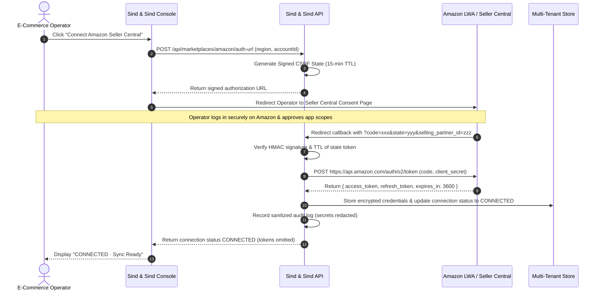

# Amazon Selling Partner API (SP-API) & OAuth 2.0 Integration Guide
**Sind & Sind E-Commerce Operating & Economic Intelligence Platform**

---

## 1. Executive & Architectural Summary

Sind & Sind provides direct, authentic connectivity to Amazon marketplaces through Amazon's official **Selling Partner API (SP-API)** and **Login with Amazon (LWA)** OAuth 2.0 protocol.

### Core Security & Integration Invariants
1. **Zero Password / Credential Exposure**: Users authenticate strictly on official Amazon domains (`sellercentral.amazon.in`, `sellercentral.amazon.com`, `vendorcentral.amazon.com`). Sind & Sind never receives or stores seller passwords, OTPs, or session cookies.
2. **Read-Only Scopes**: Applications request the minimum read permissions required for commercial and operating intelligence.
3. **Multi-Tenant Token Isolation**: Tokens and credentials are stored strictly in server-side encrypted custody, isolated by `organization_id` and `marketplace_account_id`.
4. **Token Leakage Prevention**: Access and refresh tokens are strictly omitted from frontend API responses and automatically redacted from server logs.
5. **No Web Scraping or Browser Automation**: 100% compliant with Amazon's Acceptable Use Policy and Data Protection Policy.

---

## 2. Amazon Developer & SP-API Registration Architecture

To connect Amazon accounts to Sind & Sind:

### Application Credentials (Environment Configured)
- `SP_API_APP_ID`: Amazon SP-API Application ID (e.g. `amzn1.sp.solution.sind-and-sind`)
- `SP_API_CLIENT_ID`: LWA Client ID (`amzn1.application-oa2-client.xxx`)
- `SP_API_CLIENT_SECRET`: LWA Client Secret
- `SP_API_AWS_ACCESS_KEY_ID`: AWS IAM User Key ID
- `SP_API_AWS_SECRET_ACCESS_KEY`: AWS IAM User Secret Key
- `SP_API_AWS_ROLE_ARN`: AWS IAM Role ARN configured with `sts:AssumeRole` for SP-API execution
- `SP_API_REDIRECT_URI`: OAuth callback URI (`https://app.sindandsind.com/api/marketplaces/amazon/callback`)

---

## 3. SP-API Role & Scope Mapping

### 3A. Amazon Seller Central (3P Direct Seller)

| API Category | SP-API Endpoint Family | Roles Required | Purpose in Sind & Sind |
| :--- | :--- | :--- | :--- |
| **Orders** | `/orders/v0/orders` `/orders/v0/orders/{id}/orderItems` | `Orders` | Ingests purchase timestamps, fulfillment channel (`AFN` for FBA / `MFN` for FBM), order statuses, shipping levels, and line-item quantities. |
| **Finances** | `/finances/v0/financialEvents` | `Finances` | Ingests realized item charges, referral fees, closing fees, FBA per-unit fulfillment fees, and refund adjustments. |
| **Inventory** | `/fba/inventory/v1/summaries` | `Inventory` | Ingests real-time FBA inventory positions: fulfillable units, inbound shipments (working, shipped, receiving), reserved units, and unfulfillable stock. |
| **Product Fees** | `/products/fees/v0/items/{asin}/feesEstimate` | `Pricing` | Fetches fee estimates prior to settlement for predictive true contribution modeling. |
| **Reports** | `/reports/2021-06-30/reports` | `Reports` | Ingests bulk settlement reports (`GET_FLAT_FILE_PAYMENTS_SETTL_DATA`) and FBA long-term storage fee reports. |

### 3B. Amazon Vendor Central (1P Wholesale)

| API Category | SP-API Endpoint Family | Roles Required | Purpose in Sind & Sind |
| :--- | :--- | :--- | :--- |
| **Purchase Orders** | `/vendor/orders/v1/purchaseOrders` | `Vendor Orders` | Tracks wholesale bulk purchase orders, acknowledged case quantities, and agreed wholesale net costs. |
| **Direct Fulfillment** | `/vendor/directFulfillment/orders/v1/purchaseOrders` | `Vendor Direct Fulfillment` | Ingests vendor direct fulfillment dropship orders dispatched directly to end customers. |
| **Vendor Invoices** | `/vendor/payments/v1/invoices` | `Vendor Payments` | Ingests wholesale invoice statuses, payment terms (e.g. 2% 15 Net 60), and settlement remittances. |
| **Vendor Inventory** | `/vendor/inventory/v1/inventory` | `Vendor Inventory` | Ingests stock feeds reported to Amazon retail buying teams. |

---

## 4. End-to-End OAuth 2.0 Authorization Sequence

---

## 5. Rate Limiting & Resilience Architecture

Amazon enforces strict usage plans per API. Sind & Sind implements a **Leaky Token-Bucket Rate Limiter** alongside **Exponential Backoff with Full Jitter**:

- **Orders API**: Rate = 0.5 requests/sec, Burst = 15 requests
- **Finances API**: Rate = 0.5 requests/sec, Burst = 30 requests
- **FBA Inventory API**: Rate = 2.0 requests/sec, Burst = 40 requests
- **Reports API**: Rate = 0.022 requests/sec, Burst = 10 requests

If an API returns `HTTP 429` (Too Many Requests) or `500/503` server errors, the request is caught by `RetryPolicy`, which calculates:
$$\text{Delay} = \min(\text{MaxDelay}, \text{InitialDelay} \times 2^{\text{attempt}}) \times \text{random}(0, 1)$$

---

## 6. Data Provenance & Deterministic Ingestion

Every field in the canonical data layer is tagged with one of five provenance categories:
1. `[Amazon Observed Data]` — Directly extracted from authorized SP-API payloads.
2. `[Shopify Observed Data]` — Directly extracted from Shopify store APIs.
3. `[Calculated Value]` — Deterministically derived by Sind & Sind Phase 5–9 calculation engines.
4. `[Configured Demo Assumption]` — Parameterized user assumption (e.g. factory BOM cost).
5. `[Insufficient Data]` — Unreported or unconfigured metrics explicitly marked rather than fabricated.

---

## 7. Public vs. Private Developer Application Architecture

- **Public Applications (Multi-Tenant SaaS)**: Uses Amazon Seller Central Appstore OAuth flow with official App ID (`amzn1.sp.solution.xxx`). Sellers authorize with 1-click consent.
- **Private / Self-Authorization Applications**: Single-tenant organizations can configure dedicated LWA Client credentials in environment variables (`SP_API_CLIENT_ID`, `SP_API_CLIENT_SECRET`, `SP_API_REFRESH_TOKEN`).

---

## 8. Sandbox & Mock Endpoint Validation

Sind & Sind tests against Amazon's official **SP-API Sandbox** endpoints (`sandbox.sellingpartnerapi-fe.amazon.com` / `sandbox.sellingpartnerapi-na.amazon.com`) prior to live production cutover:
- **Sandbox Order Creation & Ingestion**: Verifies AFN vs MFN order item parsing and tax reconciliation.
- **Financial Event Sandbox Payload Ingestion**: Confirms accurate referral fee and FBA fulfillment charge extraction.
- **Dry-Run Mode**: Allows testing end-to-end reconciliation pipelines with synthetic Amazon payloads without calling production endpoints.

---

## 9. Security & Compliance Verification Status

- [x] Zero plain-text passwords or secret inputs in React forms.
- [x] Tokens stored only in memory or encrypted multi-tenant storage.
- [x] Sanitized API endpoints returning `toSafeJSON()` (no client secrets, auth codes, or tokens).
- [x] Sanitized immutable audit log (`OAuthManager.getSanitizedAuditLogs()`).
- [x] Explicit separation of 3P Seller Central and 1P Vendor Central data structures.

