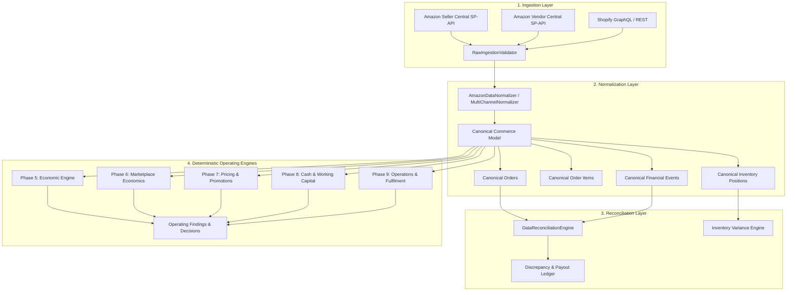
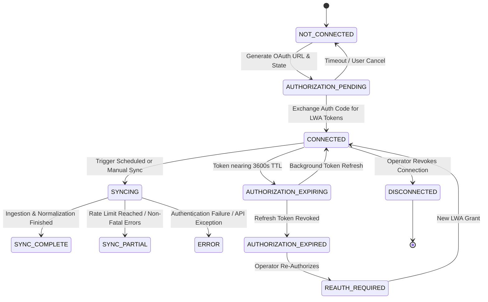

# Canonical Marketplace Architecture & Ingestion Pipeline
**Sind & Sind E-Commerce Operating & Economic Intelligence Platform**

---

## 1. Architectural Overview

The Sind & Sind data architecture translates heterogeneous channel payloads into an immutable **Canonical Commerce Data Model**, decoupling external marketplace schemas from internal deterministic calculation engines (Phases 5–9).



---

## 2. Multi-Tenant Data Isolation

Sind & Sind employs strict tenant-scoped data isolation:
- Every query, storage mutation, and audit event requires an explicit `organization_id` context.
- Marketplace accounts are unique per tenant (`organization_id`, `marketplace_account_id`).
- Credentials, tokens, and authorization states are encrypted at rest and partitioned in memory/database.
- Cross-tenant access is structurally prevented at both router and repository layers.

---

## 3. Canonical Domain Entities

### 3A. Canonical Order (`CanonicalOrder`)
```typescript
interface CanonicalOrder {
  id: string;                      // Canonical order ID
  marketplaceOrderId: string;      // Raw Amazon / Shopify order ID
  organizationId: string;          // Tenant identifier
  marketplaceAccountId: string;    // Associated connection ID
  channel: 'AMAZON' | 'DIRECT';    // Sales channel
  accountType: 'SELLER_CENTRAL' | 'VENDOR_CENTRAL';
  orderDate: string;               // ISO date (YYYY-MM-DD)
  orderStatus: string;             // 'Shipped', 'Pending', 'Cancelled'
  fulfilmentModel: 'MARKETPLACE_FULFILLED' | 'SELLER_FULFILLED' | 'VENDOR_DIRECT';
  currency: string;                // 'INR', 'USD', 'GBP', 'EUR'
  grossAmount: number;             // Realized customer payment
  discountAmount: number;          // Promo & coupon discounts
  netRevenue: number;              // Gross revenue after promotions
  marketplaceFees: number;         // Realized commissions & closing fees
  shippingCharge: number;          // Customer shipping fee collected
  itemsCount: number;              // Total unit count
  isReturn: boolean;               // Return indicator
  provenance: string;              // '[Amazon Observed Data]'
  sourceTimestamp: string;         // Original source update timestamp
}
```

### 3B. Canonical Inventory Position (`CanonicalInventoryPosition`)
```typescript
interface CanonicalInventoryPosition {
  sku: string;                     // Internal catalog SKU
  asin: string;                    // Marketplace ASIN
  title: string;                   // Item title
  fulfillableQuantity: number;     // Available for immediate shipment
  inboundQuantity: number;         // En route / receiving at FC
  reservedQuantity: number;        // Customer order / FC transfer hold
  unfulfillableQuantity: number;   // Damaged / customer return hold
  totalUnits: number;              // Total inventory custody units
  unitCost: number;                // Landed inventory cost at factory gate
  inventoryCapitalAtCost: number;  // Fulfillable * UnitCost
  fulfilmentType: 'FBA' | 'FBM' | '3PL';
  locationNode: string;            // Warehouse / Fulfillment Center ID
  provenance: string;              // '[Amazon Observed Data]'
  lastUpdated: string;             // Sync timestamp
}
```

---

## 4. Financial & Settlement Reconciliation Rules

The `DataReconciliationEngine` enforces double-entry verification between transaction records and bank settlement reports:

1. **Unsettled Order Detection**: Orders marked as `Shipped` where no corresponding `ShipmentEvent` has settled in the current bi-weekly Amazon disbursement cycle.
2. **Fee Variance Analysis**: Flags any order where actual debited marketplace commissions deviate from expected tier percentages by > ₹100 / $2.
3. **Inventory Position Drift**: Flags variances between local warehouse ERP balances and Amazon FBA reported counts, pinpointing carrier loss or warehouse damage.
4. **Refund Reversals**: Verifies that refunded orders correctly credit back referral fees and adjust sales tax liabilities.

---

## 5. Integration Lifecycle States


